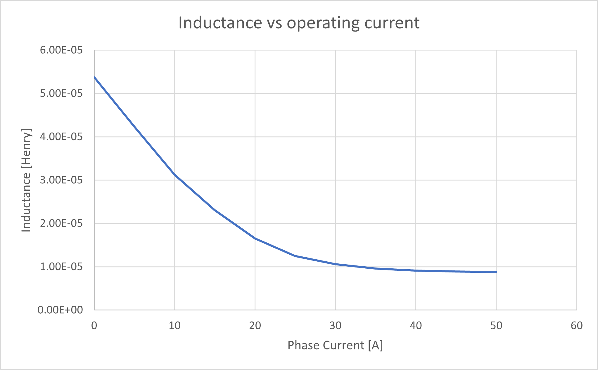

# FEMM-inductance-drop-demo
A FEMM simulation that demonstrates a drop in inductance due to high load currents.

To calculate the inductance, the script:
- set the bias current and delta_currents.
- measure the flux at bias_current + delta_current and at bias_current - delta_current.
- difference between the flux readings is the flux generated due to the currents.
- we need this 2-step process to account for the flux already generated by the magnets.

The estimated inductance is then plotted using excel. 

